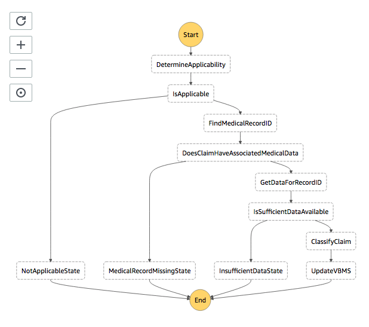

# Hypertension Identification

## Background

This project uses [AWS step functions](https://aws.amazon.com/step-functions/) to manage the flow of information through a hypertension identification system.

It is currently a proof of concept, and uses a set of predefined data to mimic calls and responses from various external systems. It should not be too much extra work to make this real.

## Git Workflow
We use the [Gitflow Workflow](https://www.atlassian.com/git/tutorials/comparing-workflows/gitflow-workflow); in summary, this means that we write code primarily in feature branches that are then merged to `develop`, and only push to the primary branch from there.

Pull requests are submitted on Github and require review in order to be merged. Our process is that reviewers approve and the submitter of the PR then merges to `develop`.

## System setup

Below is a diagram of the setup of the services:


## Tools

- Docker: For certain local development steps only; optional
- [AWS CLI](https://docs.aws.amazon.com/cli/latest/userguide/cli-chap-install.html)
- [AWS SAM CLI](https://docs.aws.amazon.com/serverless-application-model/latest/developerguide/serverless-sam-cli-install.html)
- Python
- [pyenv](https://github.com/pyenv/pyenv): Manage Python versions, can be used with poetry to create isolated environments
- [Poetry](https://python-poetry.org/): Manage all your Python package dependencies
- AWS Step Functions Local
  - AWS offers two ways to run Step Functions Local:
    - [A Docker contaner](https://docs.aws.amazon.com/step-functions/latest/dg/sfn-local-docker.html)
    - [A Java program](https://docs.aws.amazon.com/step-functions/latest/dg/sfn-local.html)
  - The Docker approach is required at least as of spring of 2021, because the Java JAR advertised on the AWS website for download and install at this time does not have support for the Amazon States Language comparator `IsNull`.

## Technologies

The Hypertension Fast-Track System is built in these technologies:

- [AWS Lambda](https://aws.amazon.com/lambda/) : language-agnostic single-purpose microservices run without a dedicated server
- [AWS Step Functions](https://aws.amazon.com/step-functions/) : Serverless orchestrator for creating state machines comprised of lambdas

## Development

Recommendation: Get familiar with these first
- [Develop and Test the Python Functions Locally](#Develop-and-Test-the-Python-Functions-Locally)
- [Deploy Everything to AWS](#Deploy-Everything-to-AWS)

_**before**_ trying
- [Develop Everything Together Locally](#Develop-Everything-Together-Locally)

### Python Environment Background Info

If the project's virtualenvs are located in `functions/FUNCTION_NAME/.venv`, then when you upen VS Code to that directory (such as via `code functions/FUNCTION_NAME/`) it will automatically see and activate the virtualenv.

This lets you:
- Run tests using vscode test integration
- Run linters and auto-formatters
- Run individual functions right from the editor

(You can do all of this in VS Code by clicking the debug icon - the settings.json and launch.json config files enable this setup.)

To have your virtualenvs located in `functions/FUNCTION_NAME/.venv` rather than the default poetry location of `~/Library/Caches/pypoetry/virtualenvs`, it _would_ require:

```bash
cd functions/FUNCTION_NAME/
$(POETRY) config --local virtualenvs.in-project true
```

**This is done for you already via the `functions/FUNCTION_NAME/poetry.toml` files.**

If you _don't_ locate your virtualenvs in `functions/FUNCTION_NAME/.venv`, then when you open VS Code to one of your `functions/FUNCTION_NAME/` directories, VS Code will pop up an error messge:

> No Python interpreter is selected. You need to select a Python interpreter to enable featuresr such as IntelliSense, linting, and debugging.

### Develop and Test the Python Functions Locally

This workflow is for locally developing the individual Python functions and locally running the their automated tests, via Python on your machine.
- Without AWS SAM local Lambda
- Without the Step Functions state machine.

Install the following [tools](#Tools):
- Python
- pyenv
- Poetry

Build Python locally:
```sh
make build.python
```

Run Python unit tests locally:
```sh
make test.python
```

### Deploy Everything to AWS

Install the following [tools](#Tools):
- AWS CLI
- AWS SAM CLI
- Python
- pyenv

Learn [AWS tutorial number 3](#AWS-Tutorials) (and any preceding number 3 that you think you need to know).

Deploy to AWS:
```sh
# First time
make deploy.sam.guided

# Subsequent times
make deploy.sam
```

Note: This literally (or perhaps just effectively) does a `sam build` as a part of its process.

### Develop Everything Together Locally

#### Introduction

This system uses AWS Step Functions and AWS Lambda.

AWS has tools to run Step Functions and Lambda locally on your machine.

- AWS has tools for running Lambda locally (which are a part of AWS SAM CLI).
- AWS a tool for running Step Functions locally (called "Step Functions Local").
- These tools are designed to also work together--where Step Functions Local (when it runs your Step Functions state machine, which references your fake Lambda function ARNs running in AWS SAM CLI) talks to the AWS SAM CLI local Lambda system.
  - This, of course, emulates the way it works in the AWS cloud when a Step Functions state machine talks to an Lambda function.

In the end, how it ends up working is:

- Lambda is running locally via `sam local start-lambda`, and it runs each of your Lambda functions in a special AWS docker container.
  - There is one Docker container per Lambda function.
  - The containers don't run constantly. The local Lambda system listens for calls. When it gets a call:
    - It talks to Docker to (pull if necessary, and...) start a special AWS-maintained Docker container for your Lambda function.
    - Run your Lambda function in the container.
    - Then delete the container.
- Your code (rather, your build-output directory, which is `aws-sam/build`) is mounted into the Lambda Docker container. Thus, whenever you make code changes and then build your code, your changes become available to the Lambda Docker container.
  - This is much faster than making code changes and then deploying your updated Lambda code to the AWS cloud.
- Step Functions is running locally. More specifically, it runs in Docker running on your machine.
  - Your state machine, which you run in Step Functions Local, references your Lambda functions (deployed locally, per above).
- When you run your state machine, it calls the AWS SAM CLI local Lambda System, which runs your Lambda functions.

#### Steps

Install the following [tools](#Tools):
- Everything

Learn [AWS tutorial number 7](#AWS-Tutorials) (and any preceding number 7 that you think you need to know).

Setup the local (fake) credentials file...

Copy the credentials sample file:

```sh
cp aws-stepfunctions-local-credentials-sample.txt aws-stepfunctions-local-credentials.txt
```

Set your configured AWS CLI region in `aws-stepfunctions-local-credentials.txt`.

Note: leave the `LAMBDA_ENDPOINT` variable as-is (e.g. `http://host.docker.internal:3001`) in order allow Step Functions Local running inside a Docker container to communication with AWS SAM CLI's local Lambda running on your machine (executed via `sam local start-lambda`). Port 3001 is the default port of AWS SAM CLI's local Lambda.

See [this link](https://docs.aws.amazon.com/step-functions/latest/dg/sfn-local-config-options.html#docker-credentials) for further info about configuring your credentials to work for Step Functions Local in Docker.

SAM build. This preps it for SAM deployment to AWS, or to mount into the Docker containers that run the Lambda functions:
```sh
make build.sam
```

Build your Step Functions ASL file for local development:
```sh
make build.asl
```

Start Lambda locally:
```sh
sam local start-lambda
```

Start Step Functions locally (in Docker, rather than the Java JAR):
```sh
docker run -p 8083:8083 --env-file aws-stepfunctions-local-credentials.txt amazon/aws-stepfunctions-local
```

Create your state machine in Step Functions Local:
```sh
aws stepfunctions --endpoint-url http://localhost:8083 create-state-machine --definition "$(cat build/hypertension.asl.json)" --name "Hypertension" --role-arn "arn:aws:iam::012345678901:role/DummyRole"
```

Note the ARN of the state machine in the returned response, for example:

```json
{
  "stateMachineArn": "arn:aws:states:YOUR_REGION:123456789012:stateMachine:Hypertension",
  "creationDate": "2020-12-28T11:13:46.746000-05:00"
}
```

Run the system:
```sh
aws stepfunctions --endpoint http://localhost:8083 start-execution --state-machine STATE_MACHINE_ARN --name test-run --input "$(cat test/state-machine-input.json)"
```

## AWS Tutorials

### 1. Learn Lambda

Learn a little Lambda if you think you need it. Just creating one via the AWS console should be plenty of knowledge for this step
- https://docs.aws.amazon.com/lambda/latest/dg/getting-started.html

### 2. Learn Step Functions

Do a quick Step Functions and Lambda tutorial if you think you need it.
- This one is nice because it has Step Functions and Lambda together https://aws.amazon.com/getting-started/hands-on/create-a-serverless-workflow-step-functions-lambda/

### 3. Learn AWS SAM CLI

Learn how to use AWS SAM CLI (in this case, to create a CloudFormation stack that has a Step Functions state machine, some lambdas, and a DynamoDB table)
- https://docs.aws.amazon.com/step-functions/latest/dg/tutorial-state-machine-using-sam.html
  - The "Stock Functions" demo in this tutorial was used as the basis for this repo

### 4. Run Lambda Locally

Learn how to run Lambda locally via the AWS SAM CLI
- https://docs.aws.amazon.com/serverless-application-model/latest/developerguide/serverless-getting-started-hello-world.html

### 5. Setup Step Functions Local

Use the Docker method. However, see both of the links for Step Functions Local in the [Tools](#Tools) section, as they both have valuable information.

If your `aws-stepfunctions-local-credentials.txt` is configured as described above, Step Functions Local in Docker should just work. It should be able to communicate with SAM CLI local Lambda as started by `sam local start-lambda`.

### 6. Deploy something to Step Functions Local

Deploy a Step Functions state machine to Step Functions Local
  - https://docs.aws.amazon.com/step-functions/latest/dg/sfn-local-computer.html

### 7. Put it all Together

- https://docs.aws.amazon.com/step-functions/latest/dg/sfn-local-lambda.html
  - Note:
    - `sam local start-api` starts your Lambda functions (locally) with a REST API in front of them (also locally), so that you can make HTTP requests against them.
    - `sam local start-lambda` starts Lambda as if it was AWS running on your machine. This allows Step Functions Local to communicate with your Lambdas the way this these AWS systems communicate with each other in the cloud.
